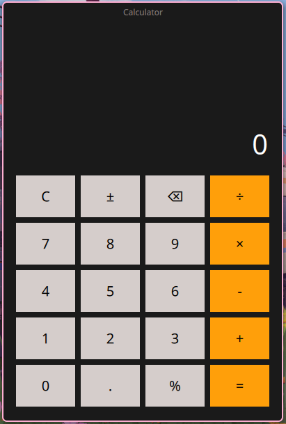

# Calculator



## Overview

Calculator is a modern Qt Quick desktop application built with CMake and Qt 6. It provides a clean, responsive user interface for basic arithmetic operations and is designed as a polished example of a Qt Quick calculator app.

## Features

- Responsive calculator UI built with QML
- Supports addition, subtraction, multiplication, and division
- Clean input handling for operator replacement and numeric entry
- Simple keyboard-friendly design for desktop use

## Build Instructions

```bash
mkdir -p build
cd build
cmake ..
cmake --build .
```

## Run

From the `build` directory:

```bash
./cal
```

## Project Structure

- `src/main.cpp` — application launcher and Qt setup
- `src/main.qml` — main QML user interface
- `CMakeLists.txt` — build configuration for Qt 6 and QML
- `preview/img1.png` — application preview image

## Requirements

- Qt 6
- CMake 4.0 or newer

## Notes

This project is ideal for exploring Qt Quick applications with CMake and demonstrates a compact, professional calculator interface.
